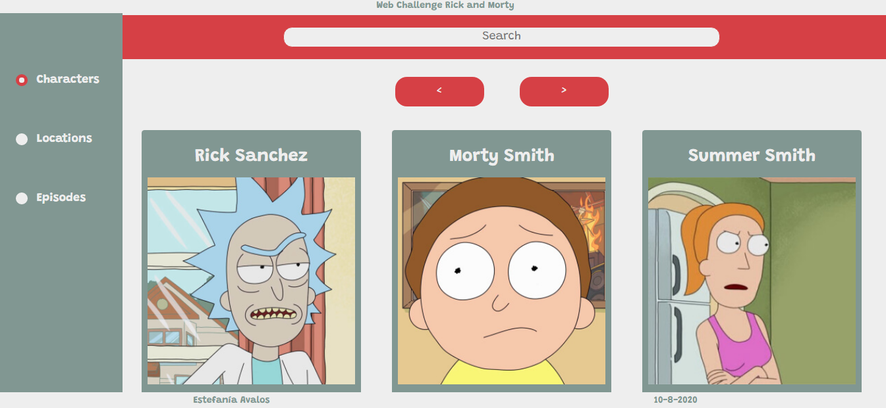
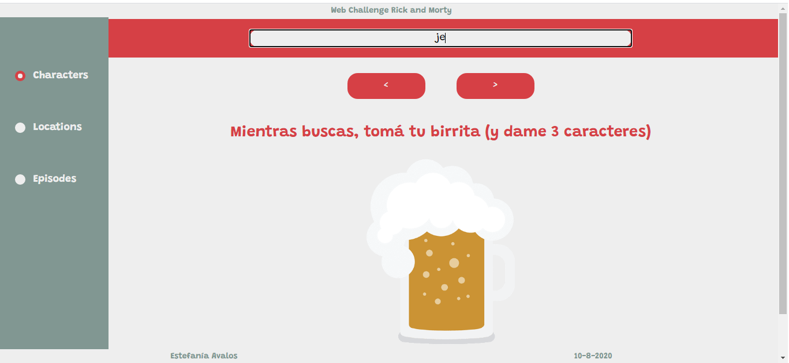
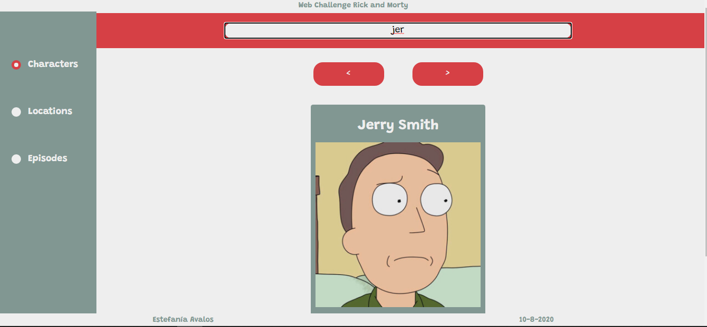
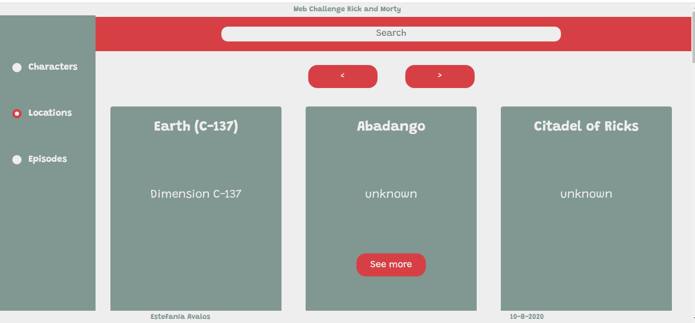
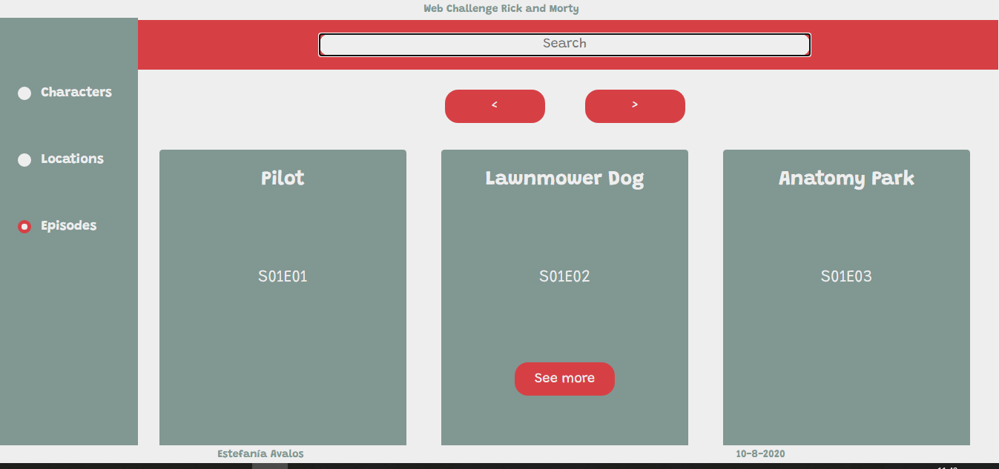
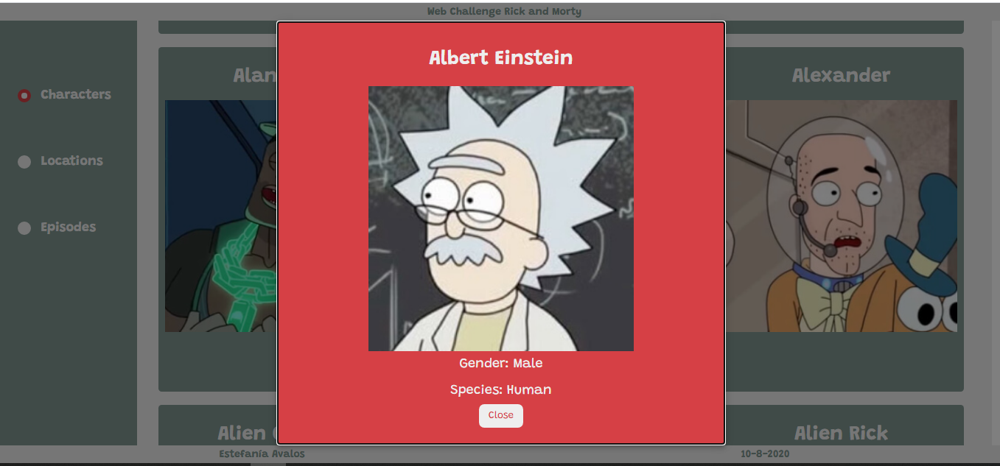

<h1>Rick and Morty Project</h1>
<h3>Para levantar el proyecto</h3>
<ul>
<li>Clonar</li>
<li>Iniciar con 'Yarn start' (requiere tener instalado Yarn)</li>
<li>Corre en local host 3000</li>
</ul>

